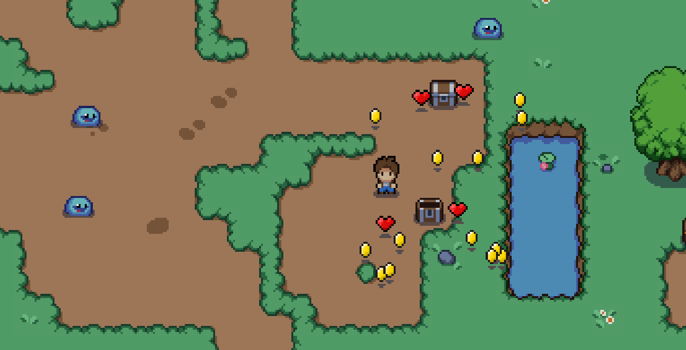
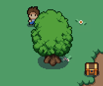
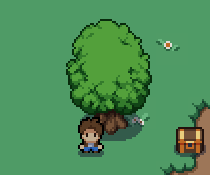
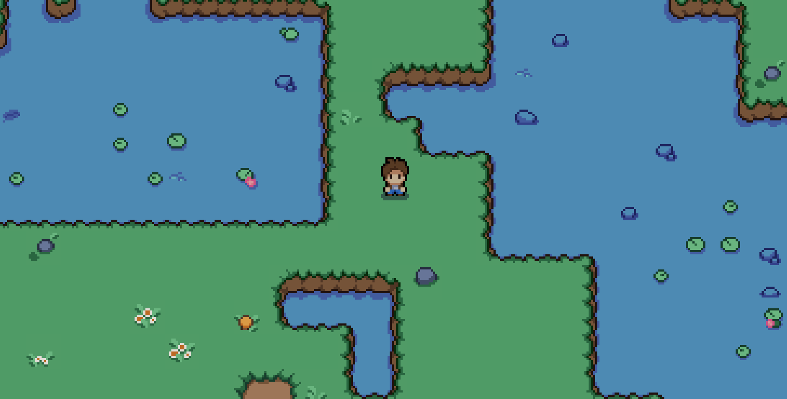
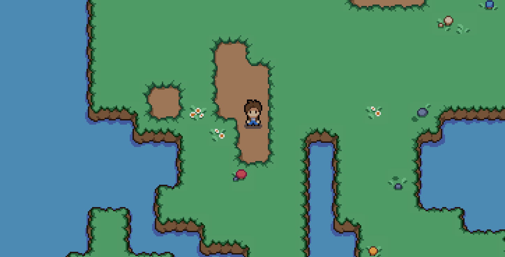
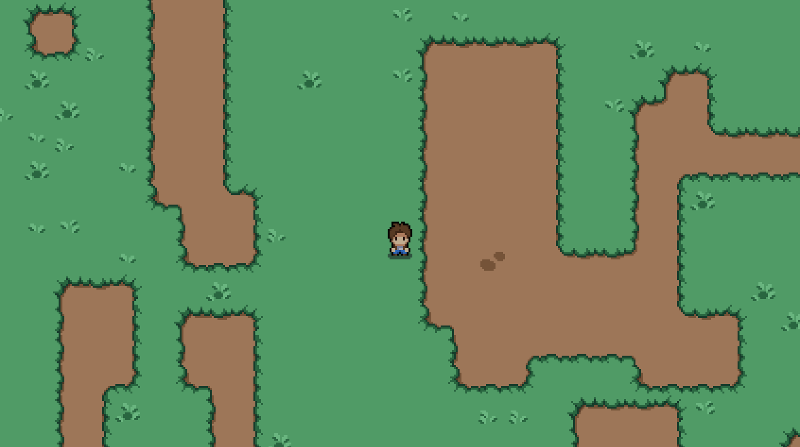
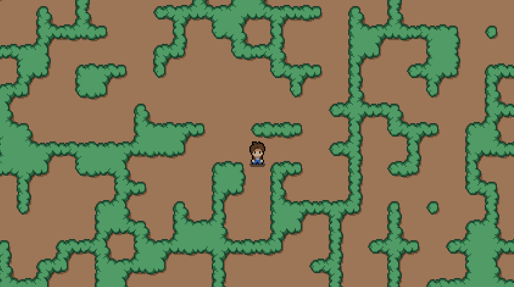
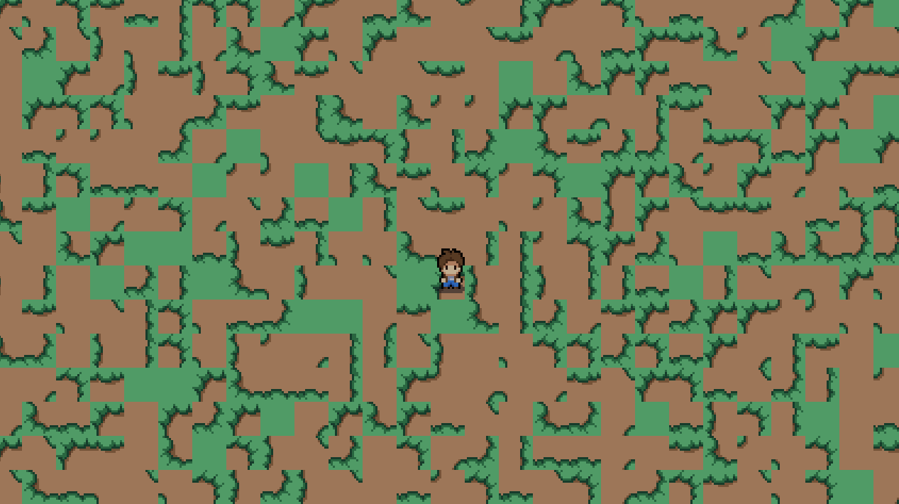

# SmolbeanPlanet

This is a little topdown scroller I created with Unity.  Initially as a way to play around with wave function collapse as a way of generating maps.

Who knows what (if anything) will follow!

## References

Followed [this](https://www.youtube.com/watch?v=7iYWpzL9GkM) tutorial to get me started.
Used the [Mystic Woods](https://twitter.com/GameEndeavor) tileset for graphics.
Some very lame sprites of my own were creared with (Piskel)[https://www.piskelapp.com/] which is a free, web-based editor.

## Screenshots

Everyone loves coins and hearts!

Trees you can walk behind and in front of...

Added water embelishments

Added water

Wave function collapse with weighted distribution of tiles - encouraging larger grass and mud areas

Simple wave function collapse

Random tiles with no constraints

